# 实验1： Servlet入门使用

## 实验目的 

1. 掌握 Servlet 的定义
2. 熟悉 Servlet 的使用


## 实验内容

### 快速入门： 

1. 创建 JavaEE 项目
2. 定义一个类，实现 Servlet 接口 `public class ServletDemo1 implements Servlet `

3. 实现接口中的抽象方法 
4. 配置 Servlet 在 web.xml 中配置：

```java
<!--配置 Servlet --> 
<servlet> 
  <servlet-name>demo1</servlet-name>
  <servlet-class>cn.itcast.web.servlet.ServletDemo1</servlet-class>
</servlet> 
  <servlet-mapping> 
  <servlet-name>demo1</servlet-name>
  <url-pattern>/demo1</url-pattern>
</servlet-mapping>
```

### 执行原理： 

1. 当服务器接受到客户端浏览器的请求后，会解析请求 URL 路径， 获取访问的 Servlet 的资源路径。

2. 查找 `web.xml` 文件，是否有对应的`<url-pattern>`标签体内容. 
3. 如果有，则在找到对应的`<servlet-class>`全类名. 
4. tomcat 会将字节码文件加载进内存，并且创建其对象. 
5. 调用其方法.


## 实验题目

### 1. 在页面上显示1-9共9个链接，单击每个链接，能够在另一个页面中打印出该数字的平方.

#### 源代码

```jsp
<%@ page contentType="text/html;charset=UTF-8" language="java" %>
<!doctype html>
<html lang="zh">
<head>
    <meta charset="UTF-8">
    <meta name="viewport"
          content="width=device-width, user-scalable=no, initial-scale=1.0, maximum-scale=1.0, minimum-scale=1.0">
    <meta http-equiv="X-UA-Compatible" content="ie=edge">
    <title>平方的计算</title>
</head>
<body>
<div class="flex gap-3 text-lg font-bold">
    <a class="transition text-blue-500 hover:text-blue-600"
       href="${pageContext.request.contextPath}/first-calculate-the-squared?number=1">
        1
    </a>
    <a class="transition text-blue-500 hover:text-blue-600"
       href="${pageContext.request.contextPath}/first-calculate-the-squared?number=2">
        2
    </a>
    <a class="transition text-blue-500 hover:text-blue-600"
       href="${pageContext.request.contextPath}/first-calculate-the-squared?number=3">
        3
    </a>
    <a class="transition text-blue-500 hover:text-blue-600"
       href="${pageContext.request.contextPath}/first-calculate-the-squared?number=4">
        4
    </a>
    <a class="transition text-blue-500 hover:text-blue-600"
       href="${pageContext.request.contextPath}/first-calculate-the-squared?number=5">
        5
    </a>
    <a class="transition text-blue-500 hover:text-blue-600"
       href="${pageContext.request.contextPath}/first-calculate-the-squared?number=6">
        6
    </a>
    <a class="transition text-blue-500 hover:text-blue-600"
       href="${pageContext.request.contextPath}/first-calculate-the-squared?number=7">
        7
    </a>
    <a class="transition text-blue-500 hover:text-blue-600"
       href="${pageContext.request.contextPath}/first-calculate-the-squared?number=8">
        8
    </a>
    <a class="transition text-blue-500 hover:text-blue-600"
       href="${pageContext.request.contextPath}/first-calculate-the-squared?number=9">
        9
    </a>
</div>
</body>
<script src="https://cdn.tailwindcss.com"></script>
</html>
```

```java
package com.xlf.experiment1.controller;

import jakarta.servlet.ServletException;
import jakarta.servlet.annotation.WebServlet;
import jakarta.servlet.http.HttpServlet;
import jakarta.servlet.http.HttpServletRequest;
import jakarta.servlet.http.HttpServletResponse;
import org.jetbrains.annotations.NotNull;

import java.io.IOException;
import java.util.Map;

/**
 * 计算平方的控制器
 * <p>
 * 在页面上显示1-9共9个链接，单击每个链接，能够在另一个页面中打印出该数字的平方。
 *
 * @since v1.0.0
 * @version v1.0.0
 * @author xiaolfeng
 */
@WebServlet(name = "firstCalculateTheSquaredController", value = "/first-calculate-the-squared")
public class FirstCalculateTheSquaredController extends HttpServlet {

    @Override
    protected void doGet(@NotNull HttpServletRequest req, HttpServletResponse resp) throws ServletException, IOException {
        Map<String, String[]> param = req.getParameterMap();
        resp.setContentType("text/html;charset=UTF-8");
        if (param.containsKey("number")) {
            int num = Integer.parseInt(param.get("number")[0]);
            int squared = num * num;
            resp.getWriter().println("平方 " + num + " 是 " + squared);
        } else {
            resp.getWriter().println("请输入一个数字");
        }
    }
}
```

#### 截图

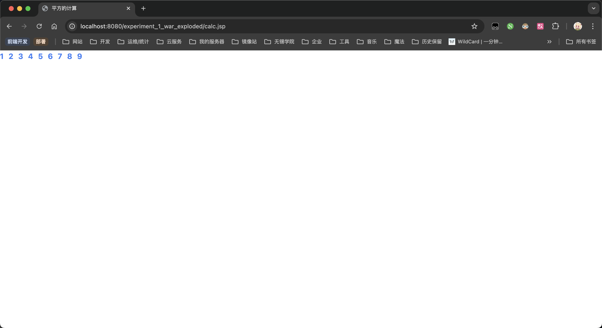

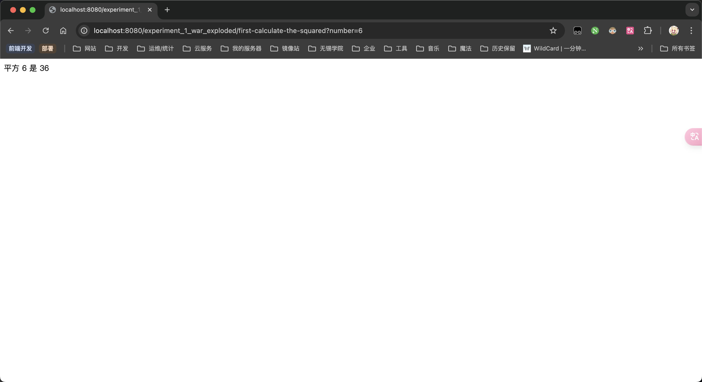


### 2. 用JSP声明编写一个函数，输入一个整数参数，以集合形式表示各种纸币找零的数量，输入1-100中的数值。假如系统中有50,20,10,5,1这5种面额的纸币，显示每种纸币应该找的数量。例如，78应该为50元1张、20元1张、5元1张、1元3张。然后用JSP程序段来运行这个函数.

#### 源代码

```jsp
<%@ page contentType="text/html;charset=UTF-8" language="java" %>
<!doctype html>
<html lang="zh">
<head>
    <meta charset="UTF-8">
    <meta name="viewport"
          content="width=device-width, user-scalable=no, initial-scale=1.0, maximum-scale=1.0, minimum-scale=1.0">
    <meta http-equiv="X-UA-Compatible" content="ie=edge">
    <title>纸币找零</title>
</head>
<body>
<div class="text-2xl font-bold">纸币找零计算</div>

<form method="get" action="${pageContext.request.contextPath}/banknotes.jsp" class="p-6">
    <label>
        <input type="text" name="inputAmount" class="border border-grey-500 px-2 py-1 rounded-lg shadow-lg" value="<%
        if (request.getParameter("inputAmount") != null) {
        out.println(request.getParameter("inputAmount"));
        } else {
        out.println(78);
        }
        %>" placeholder="请输入金额">
    </label>
    <button type="submit" class="transition bg-blue-400 hover:bg-blue-500 shadow-lg rounded-lg px-2 py-1">计算</button>
</form>

<%
    // 输入的金额
    int inputAmount = 78;

    if (request.getParameter("inputAmount") != null) {
        inputAmount = Integer.parseInt(request.getParameter("inputAmount"));
    }

    // 面额数组
    int[] bills = {50, 20, 10, 5, 1};
    int[] counts = new int[bills.length];

    // 计算每种面额纸币的数量
    for (int i = 0; i < bills.length; i++) {
        counts[i] = inputAmount / bills[i];
        inputAmount %= bills[i];
    }

    // 输出结果
%>

<h3>找零方案：</h3>
<ul class="p-8 grid gap-1">
    <%
        for (int i = 0; i < bills.length; i++) {
            if (counts[i] > 0) {
                // 输出每种面额和数量
                out.println("<li>" + bills[i] + "元: " + counts[i] + "张</li>");
            }
        }
    %>
</ul>

</body>
<script src="https://cdn.tailwindcss.com"></script>
</html>
```

#### 截图

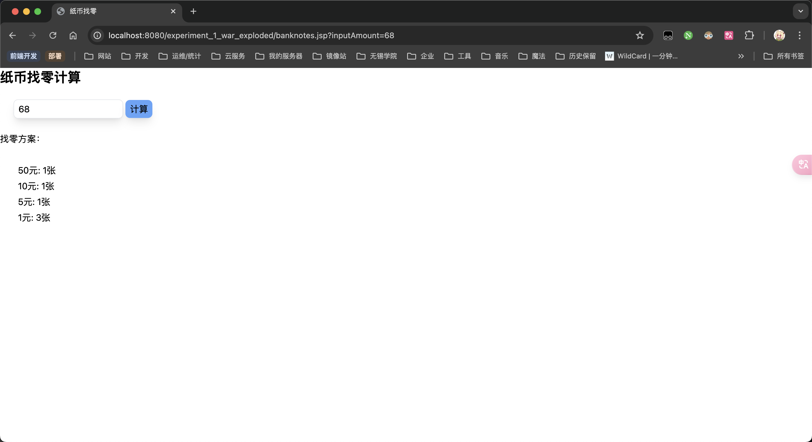


### 3. 自定义一个注册页面，然后使用Servlet程序将用户输入的信息再另一个页面显示处理。要求：JavaScript程序判断用户名等不能为空.

#### 源代码

```jsp
<%@ page contentType="text/html;charset=UTF-8" language="java" %>
<!doctype html>
<html lang="zh">
<head>
    <meta charset="UTF-8">
    <meta name="viewport"
          content="width=device-width, user-scalable=no, initial-scale=1.0, maximum-scale=1.0, minimum-scale=1.0">
    <meta http-equiv="X-UA-Compatible" content="ie=edge">
    <title>Document</title>
</head>
<body class="grid justify-center bg-gray-50/75 p-8">
<div class="grid gap-3 p-6 shadow-lg bg-white rounded-lg">
    <div class="text-2xl font-bold">登录</div>
    <form method="post" action="${pageContext.request.contextPath}/user-login" class="grid gap-3" onsubmit="submitFunction(event)">
        <label>
            <input type="text" name="username" class="border border-grey-500 px-2 py-1 rounded-lg shadow-lg"
                   placeholder="请输入用户名">
        </label>
        <label>
            <input type="password" name="password" class="border border-grey-500 px-2 py-1 rounded-lg shadow-lg"
                   placeholder="请输入密码">
        </label>
        <button type="submit" class="transition bg-blue-400 hover:bg-blue-500 shadow-lg rounded-lg px-2 py-1">
            登录
        </button>
    </form>
</div>
</body>
<script src="https://cdn.tailwindcss.com"></script>
<script type="application/javascript">
    function submitFunction(event) {
        event.preventDefault();
        const username = document.querySelector('input[name="username"]').value;
        const password = document.querySelector('input[name="password"]').value;
        if (username === '' || username == null) {
            alert('请输入用户名');
            return;
        }
        if (password === '' || password == null) {
            alert('请输入密码');
            return;
        }
        document.querySelector('form').submit();
    }
</script>
</html>
```

```java
package com.xlf.experiment1.controller;

import jakarta.servlet.ServletException;
import jakarta.servlet.annotation.WebServlet;
import jakarta.servlet.http.HttpServlet;
import jakarta.servlet.http.HttpServletRequest;
import jakarta.servlet.http.HttpServletResponse;
import org.jetbrains.annotations.NotNull;

import java.io.IOException;
import java.util.Map;

/**
 * 用户登录控制器
 * <p>
 * 用户登录控制器
 *
 * @author xiao_lfeng
 * @version v1.0.0
 * @since v1.0.0
 */
@WebServlet(name = "userLoginController", value = "/user-login")
public class UserLoginController extends HttpServlet {
    @Override
    protected void doPost(
            @NotNull HttpServletRequest req,
            @NotNull HttpServletResponse resp
    ) throws ServletException, IOException {
        resp.setContentType("text/html;charset=UTF-8");
        Map<String, String[]> param = req.getParameterMap();
        if (param.containsKey("username") && param.containsKey("password")) {
            String username = param.get("username")[0];
            String password = param.get("password")[0];
            if ("admin".equals(username) && "123456".equals(password)) {
                resp.getWriter().println("登录成功");
                resp.getWriter().println("欢迎您，" + username);
            } else {
                resp.getWriter().print("登录失败：");
                resp.getWriter().println("用户名或密码错误");
            }
        } else {
            resp.getWriter().println("请输入用户名和密码");
        }
    }
}
```

#### 截图

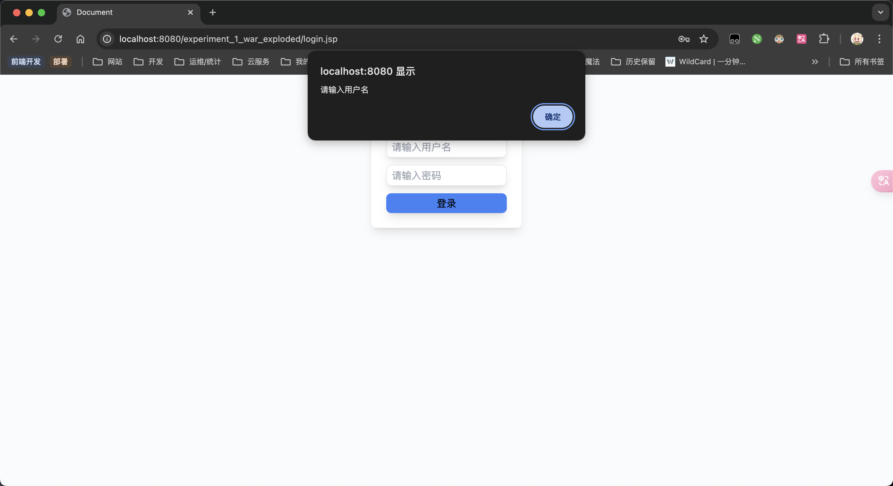

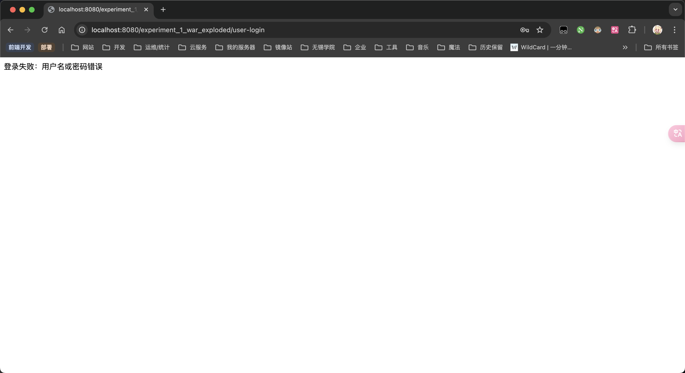

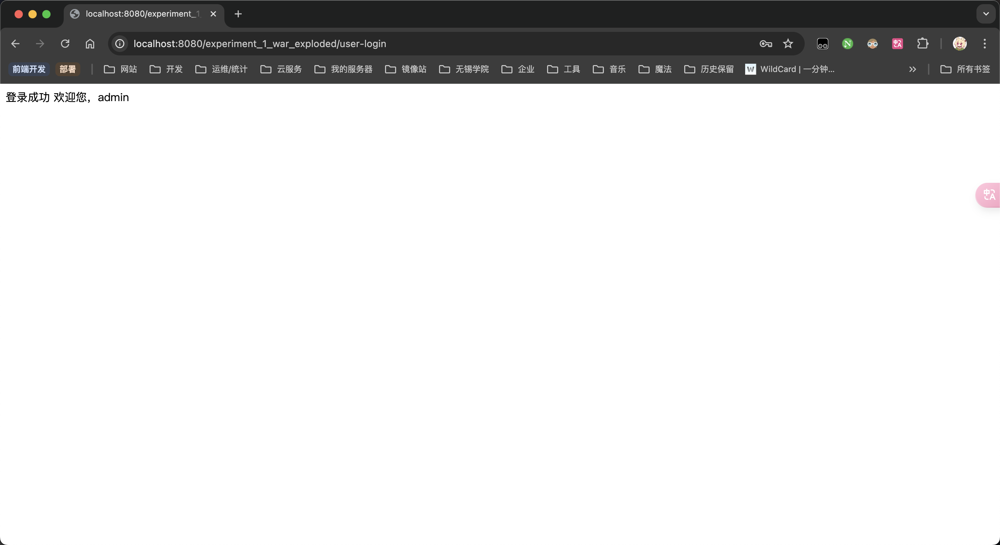


### 4. 编写JS程序，显示日期.

#### 源代码

```jsp
<%@ page contentType="text/html;charset=UTF-8" language="java" %>
<!doctype html>
<html lang="zh">
<head>
    <meta charset="UTF-8">
    <meta name="viewport"
          content="width=device-width, user-scalable=no, initial-scale=1.0, maximum-scale=1.0, minimum-scale=1.0">
    <meta http-equiv="X-UA-Compatible" content="ie=edge">
    <title>Document</title>
</head>
<body>
<h1>我的第一个 JavaScript 程序</h1>
<p id="demo">这是一个段落</p>

<button type="button" onclick="displayDate()">显示日期</button>
</body>
<script>
    function displayDate() {
        document.getElementById("demo").innerHTML = Date();
    }
</script>
</html>
```

#### 截图

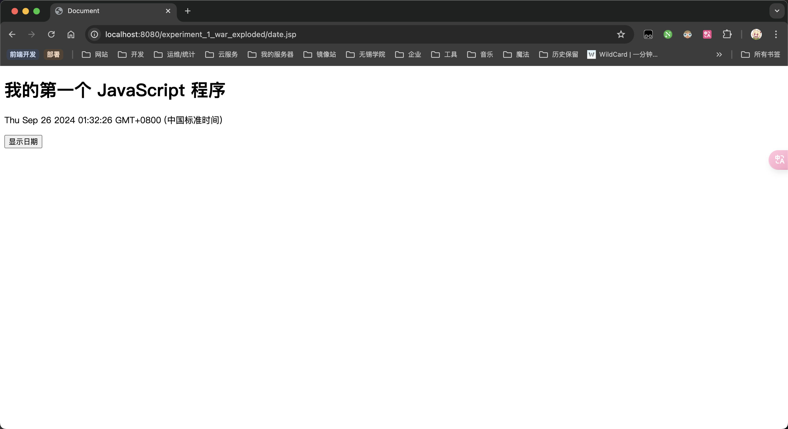


### 5. 使用表单的 POST 方法实例.

#### 源代码

```jsp
<%@ page language="java" contentType="text/html; charset=UTF-8"
         pageEncoding="UTF-8" %>
<!DOCTYPE html>
<html>
<head>
    <meta charset="utf-8">
    <title>使用 POST 方法读取数据</title>
</head>
<body>
<h1>使用 POST 方法读取数据</h1>
<ul>
    <li>
        <p>
            <b>站点名:</b>
            <%
                // 我的电脑是 macOS 默认使用 UTF-8 不需要转
                // String name = new String((request.getParameter("name")).getBytes(StandardCharsets.ISO_8859_1), StandardCharsets.UTF_8);
                String name = request.getParameter("name");
            %>
            <%=name%>
        </p>
    </li>
    <li>
        <p>
            <b>网址:</b>
            <%= request.getParameter("url")%>
        </p>
    </li>
</ul>
</body>
</html>
```

```html
<!DOCTYPE html>
<html lang="zh">
<head>
    <meta charset="utf-8">
    <title>菜鸟教程(runoob.com)</title></head>
<body>
<form action="main.jsp" method="POST">
    站点名: <input type="text" name="name"><br/>
    网址: <input type="text" name="url"/><input type="submit" value="提交"/></form>
</body>
</html>
```

#### 截图

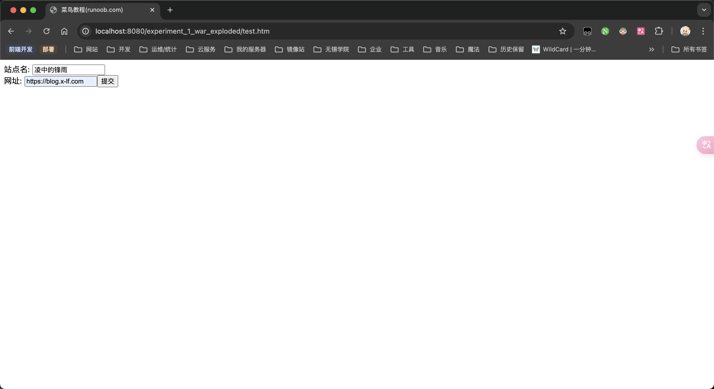

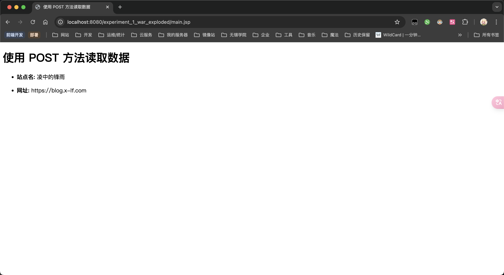


### 6. 将复选框数据传递到 Servlet 程序.

#### 源代码

```html
<!DOCTYPE html>
<html lang="zh">
<head>
    <meta charset="utf-8">
    <title>JSP教程(runoob.com)</title></head>
<body>
<form action="./check-box" method="post" target="_blank">
    <label>
        <input type="checkbox" name="runoob" checked="checked"/>
        JSP教程
    </label>
    <label>
        <input type="checkbox" name="google"/>
        Google
    </label>
    <label>
        <input type="checkbox" name="taobao" checked="checked"/>
        淘宝
    </label>
    <input type="submit" value="选择站点"/>
</form>
</body>
</html>
```

```java
package com.xlf.experiment1.controller;

import jakarta.servlet.ServletException;
import jakarta.servlet.annotation.WebServlet;
import jakarta.servlet.http.HttpServlet;
import jakarta.servlet.http.HttpServletRequest;
import jakarta.servlet.http.HttpServletResponse;

import java.io.IOException;
import java.io.PrintWriter;

/**
 * 复选框控制器
 * <p>
 * 将复选框数据传递到 Servlet 程序
 *
 * @since v1.0.0
 * @version v1.0.0
 * @author xiao_lfeng
 */
@WebServlet(name = "checkBoxController", value = "/check-box")
public class CheckBoxController extends HttpServlet {

    @Override
    protected void doGet(HttpServletRequest request, HttpServletResponse response) throws ServletException, IOException {

        // 设置响应内容类型
        response.setContentType("text/html;charset=UTF-8");

        PrintWriter out = response.getWriter();
        String title = "读取复选框数据";
        String docType = "<!DOCTYPE html> \n";
        out.println(docType +
                "<html>\n" +
                "<head><title>" + title + "</title></head>\n" +
                "<body bgcolor=\"#f0f0f0\">\n" +
                "<h1 align=\"center\">" + title + "</h1>\n" +
                "<ul>\n" +
                "  <li><b>JSP按教程标识：</b>: "
                + request.getParameter("runoob") + "\n" +
                "  <li><b>Google 标识：</b>: "
                + request.getParameter("google") + "\n" +
                "  <li><b>淘宝标识：</b>: "
                + request.getParameter("taobao") + "\n" +
                "</ul>\n" +
                "</body></html>");
    }

    // 处理 POST 方法请求的方法
    @Override
    public void doPost(HttpServletRequest request, HttpServletResponse response) throws ServletException, IOException {
        doGet(request, response);
    }
}
```

#### 截图

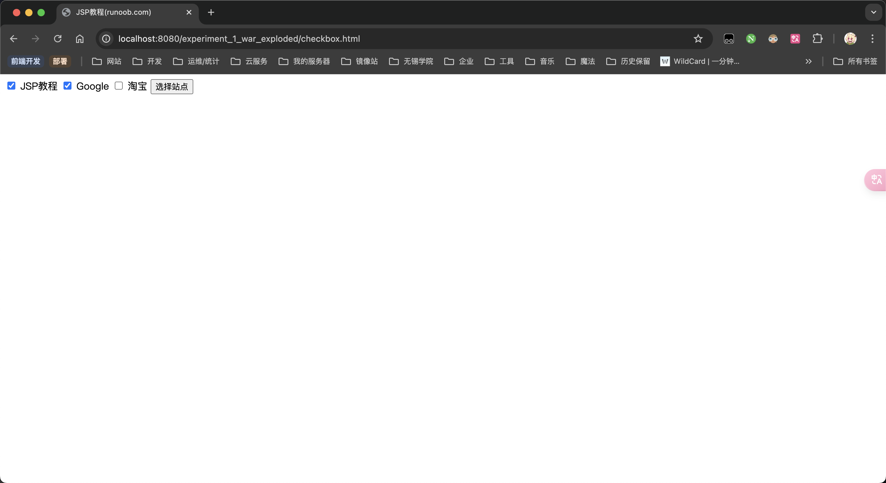

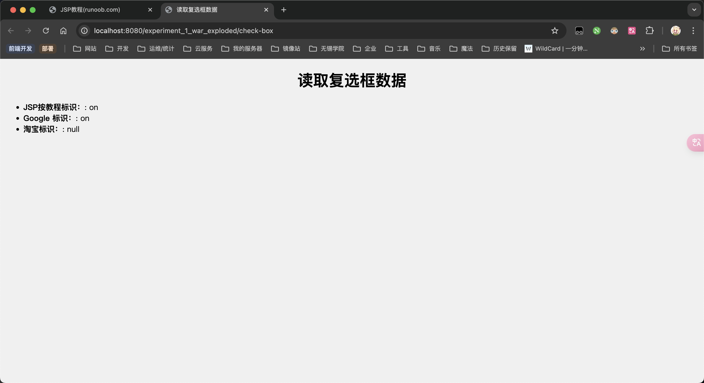
